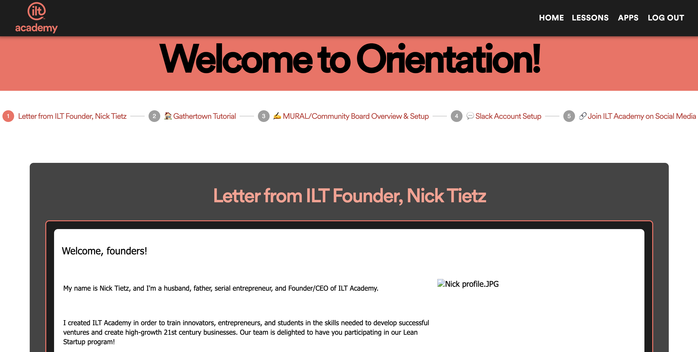
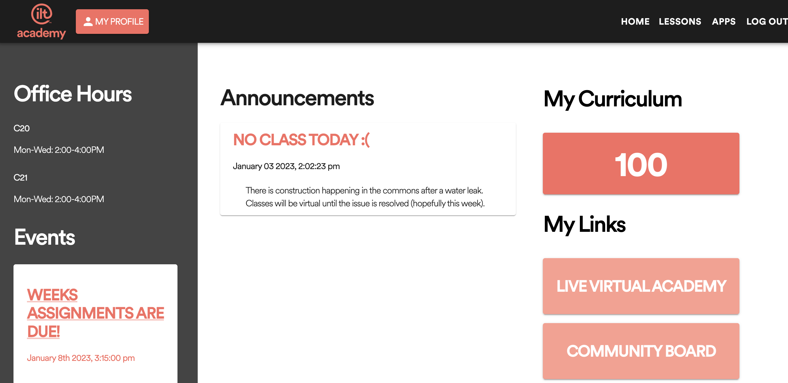
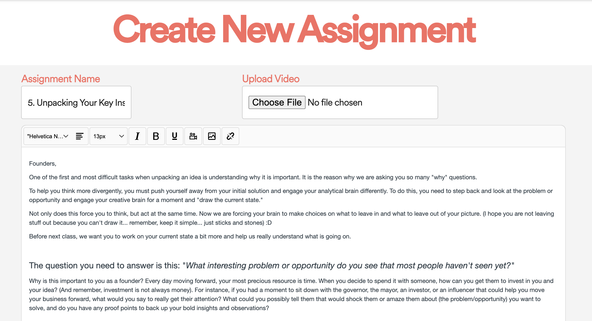

# ILT Academy

## Description

Duration: 2 Week Sprint

This project is the initial development of a locally hosted learning management system at an entrepeneurial startup called ILT Academy. It is intended to be the first in a series of technologies to migrate current systems from 3rd party apps to ILT's website. The current application is built to replace Canvas as a learning management system. There are two roles, student (user) and teacher(admin). The administrator/teacher can create curriculum, view student submissions, edit the orientation for students during onboarding, and manage classes of students(cohorts). The student can view curriculum, school announcements, school events. Upon completion of lessons students can submit assignments and if they want to make a change to their submission they can resubmit their assignment.

## Screen Shot

- Orientation

-Student Dashboard

-Lesson Creation

### Prerequisites

What things you need to install the software and how to install them

- [Node.js](https://nodejs.org/en/)
- [PostrgeSQL](https://www.postgresql.org/)
- [Nodemon](https://nodemon.io/)

### Installing

To run this application on your computer follow these steps:
1) Clone this repository and run 'npm install'
2) Create a database titled 'ilt_academy'
3) Run the sql query located in 'database.sql'
4) Create a .env File with the following values

SERVER_SESSION_SECRET = 'random string'

### Google API Information and Google Calendar ID 
- GOOGLE_PROJECT_NUMBER
- GOOGLE_CALENDAR_ID
- GOOGLE_PRIVATE_KEY
- GOOGLE_CLIENT_EMAIL
- GOOGLE_SCOPES

### AWS S-3 Information
- AWS_ACCESS_KEY
- AWS_SECRET_KEY
- AWS_BUCKET_NAME
- AWS_BUCKET_REGION

5) Start the server using 'npm run server'
6) Start the client using 'npm run client'

## Built With

Technologies used:
- Material UI
- Axios
- date-fns
- dotenv
- express
- form-data
- moment.js
- multer
- passport
- react
- react-easy-crop
- react-router-dom
- react-dom
- redux-lobber/redux-saga/redux/react-redux
- sweetalert2
- AWS S3
- Google Calendar API
- SunEditor (WYSIWIG)

## Lessons learned

- Reuse components and follow the Single Responsibility more than it currently is. Will make debugging, styling, and development more streamlined.
- Use MUI Compenents from the start so replacing all typography, form inputs and logic is not necessary

### Future Development Goals

- Create a local community board to replace Slack
- Build a virtual academy to replace Gather
- Create a resources page where students and instructors can post articles, resources, and community information to provide founders with continuous improvement
- Create a poster board to relace Mural
- Refactor current Code
- Build in due dates
- Build in localized calendar that can link and share to google calendars\
- Build mentorship program into the application

## Acknowledgement

Thanks to Nick Tietz and [ILT Academy](https://iltacademy.io/), [Prime Digital Academy](www.primeacademy.io) where we were taught how to make this application a reality. Thank you to Edan Schwartz, our fearless instructor and advisor, our cohort mates who helped support us through this entire process, and finally, our families and friends. 

## Support
If you have suggestions or issues, please email us at 
- jordan13wolter@gmail.com
- samuel.v.phipps@gmail.com
- lydiawildes1@gmail.com
- jvillegas422@gmail.com